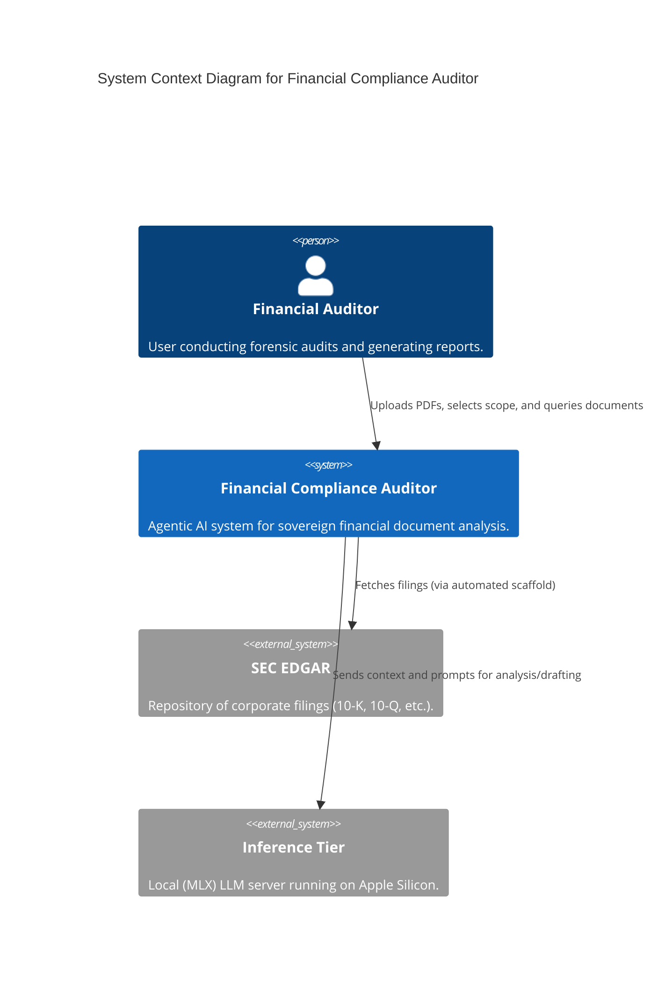
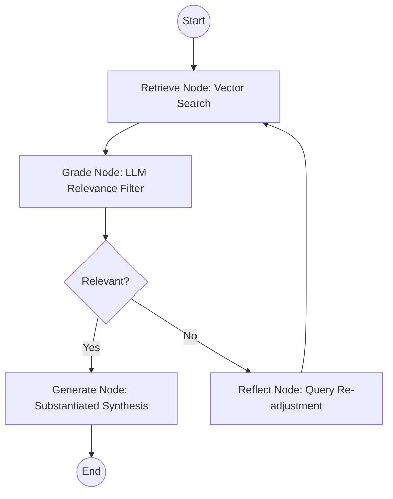

# 🏗️ System Architecture & Engineering Specification

This document provides a deep-dive into the technical internals, data schemas, and agentic workflows of the Financial Compliance Auditor.

---

## 🗺️ System Design (C4 Model)

We use the C4 model to visualize the system's architecture across different levels of abstraction.

### Level 1: System Context

Illustrates the auditor in the context of its users and the external systems.

---

## 🧠 Agentic Reasoning Workflow (LangGraph)

The core Reasoning Engine is orhcestrated using a **Directed Acyclic Graph (DAG)** to ensure verifiable outputs.

1.  **Retrieve Node**: Performs a multi-filter vector search (Ticker + Industry + Year) using LanceDB.
2.  **Grade Node**: A dedicated LLM pass evaluates each context chunk against the query. Irrelevant noise is purged.
3.  **Reflect Node**: If zero relevance is found, the system self-corrects the query to find better evidence.
4.  **Generate Node**: Produces the final report with `REF_XXX` markers mapped to coordinate metadata.

---

## 🗄️ Database & Schema Design

We utilize **LanceDB** for vector storage, chosen for its zero-management overhead and high performance on local disk.

### Table Schema: `compliance_audit`

| Field         | Type          | Description                                             |
| :------------ | :------------ | :------------------------------------------------------ |
| `vector`      | `Vector(384)` | Sentence transformer embedding (all-MiniLM-L6-v2).      |
| `text`        | `String`      | Raw source content from the PDF chunk.                  |
| `ticker`      | `String`      | Stock ticker symbol for scope isolation.                |
| `section`     | `String`      | Document type (e.g., Table, Text, Header).              |
| `page_number` | `Int`         | 1-indexed PDF page reference.                           |
| `bbox`        | `JSON String` | 4-point polygon `[[x0,y0], [x1,y1], [x2,y2], [x3,y3]]`. |
| `table_json`  | `HTML/String` | Sanitized HTML for tabular data rendering.              |

---

## 📍 Coordinate Systems & Visual Citations

The "Visual RAG" capability relies on transforming coordinates between different layout systems:

1.  **Source**: `Unstructured.io` parses PDFs and provides normalized coordinates (0-1000 range).
2.  **Storage**: Coordinates are persisted as JSON polygons in the `bbox` field.
3.  **Frontend**: The `pdf_viewer.py` component uses `pdf.js` to render the page and overlays a SVG/Canvas highlight by scaling the normalized bboxes to the viewer's viewport dimensions.

---

## 🎨 Design System (Technical Tokens)

The Workbench follows a "Financial Terminal" aesthetic, prioritizing high-legibility and institutional gravitas.

- **Primary Colors**: Deep Navy (`#0A192F`) and Metallic Gold (`#D4AF37`) for highlights.
- **Typography**:
  - **Headers**: `IBM Plex Sans` (Light 600)
  - **Interface**: `Inter`
  - **Monospace**: `JetBrains Mono` (Reference IDs, page numbers, and raw data).
- **Iconography**: Standardized SVG icons with a fixed 16px footprint for UI density.

---

## 🗝️ Security & Privacy Architecture

- **0-Telemetry**: No data is sent to OpenAI, Anthropic, or any third-party.
- **Local Inference**: The system binds strictly to `localhost:8080`.
- **Stateless Agent**: The LangGraph state is kept in-memory; no query history is persisted to disk, maintaining auditor-client privilege.
